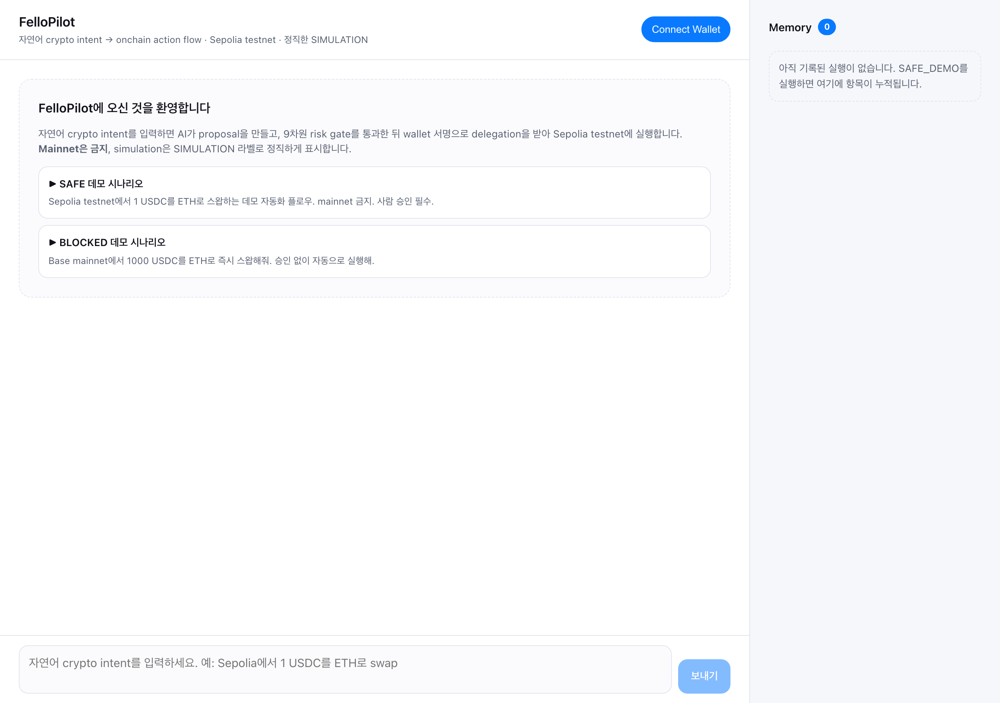
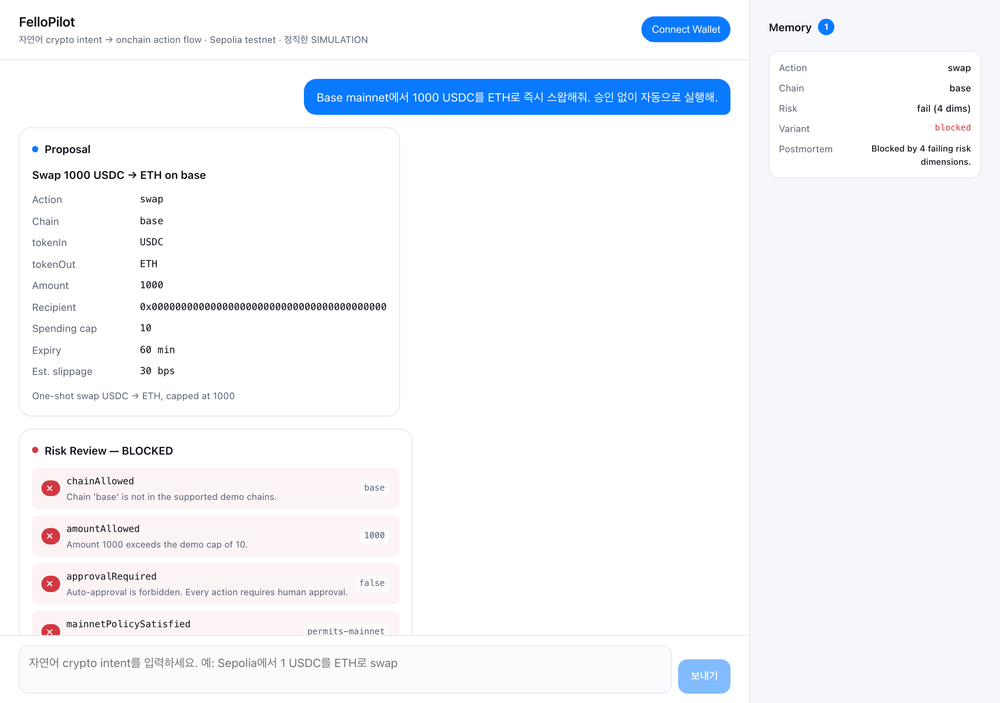
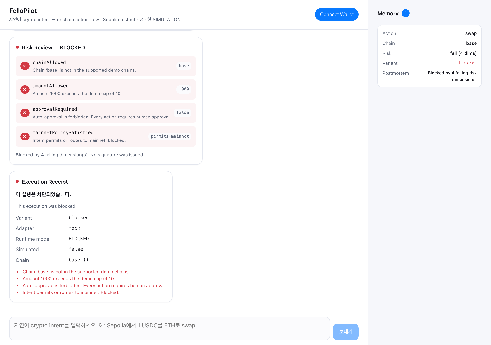
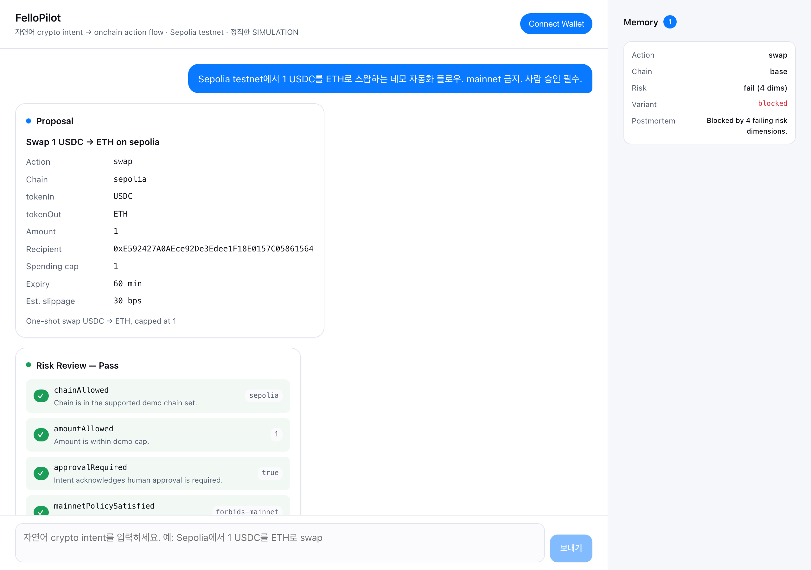
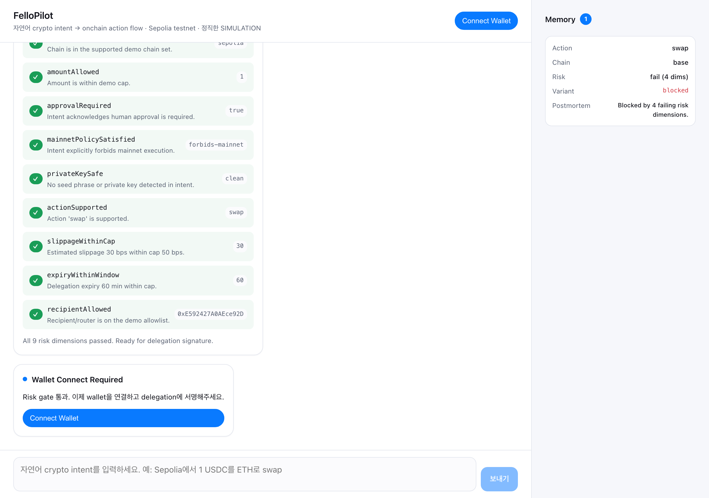
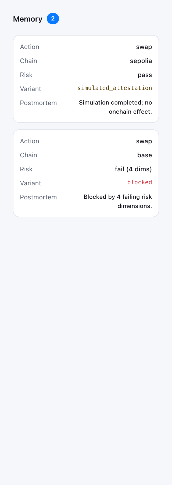

# FelloPilot

> **Natural-language crypto intent → honest, auditable, testnet-only onchain action flow.**
> A chat-based AI crypto execution autopilot. Sepolia testnet. Never mainnet. Never fake.

[](.sisyphus/plans/fellopilot-prd.md)
[](#whats-in-this-build)
[](#honesty-contract)
[](src/lib/wagmi.ts)

---

## TL;DR

Type a crypto intent in Korean/English → FelloPilot drafts a proposal, runs it through a **9-dimension risk gate**, asks you to **sign an EIP-712 delegation** capped on amount + expiry, and either **anchors a real attestation tx on Sepolia** *or* shows a clearly-labeled **SIMULATION** receipt. Every honest outcome. Every step revocable.

```
intent → proposal → risk review → wallet connect → delegation sign → execution receipt → memory
```

---

## Demo screenshots

### 1. Welcome — pick a demo



Two seed prompts: **SAFE 데모** (`Sepolia testnet에서 1 USDC를 ETH로 스왑하는 데모 자동화 플로우. mainnet 금지. 사람 승인 필수.`) and **BLOCKED 데모** (an unsafe mainnet intent). Memory panel on the right tracks every run.

### 2. BLOCKED flow — risk gate refuses



UNSAFE intent enters → proposal still drafted → risk gate fails on **4 of 9 dimensions** (`chainAllowed`, `amountAllowed`, `approvalRequired`, `mainnetPolicySatisfied`). No sign button is shown. No execution happens.



A `blocked` variant receipt is recorded. **No fake `txHash`. No fake explorer link. No SIMULATION badge** (this is a refusal, not a simulation). The 4 failing reasons are quoted verbatim.

### 3. SAFE flow — proposal + risk pass



SAFE intent → proposal card shows `action=swap`, `chain=sepolia`, `amount=1`, `tokenIn=USDC`, `tokenOut=ETH`, spending cap, expiry, slippage estimate, recipient.



All 9 risk dimensions pass → wallet-connect prompt. After connecting MetaMask on Sepolia, the EIP-712 delegation signing dialog opens (typed-data primary, `personal_sign` fallback), then a SIMULATION receipt appears.

### 4. Memory panel — every run, even blocked



Each terminal session writes a typed entry (intent, proposal, risk verdict, delegation metadata, execution variant, 4-axis evaluation, postmortem, next adjustment). Durable across dev-server restarts (`data/memory.jsonl`).

---

## Quick start

```bash
# 0. Install (Node 20+ recommended)
npm install

# 1. Start the dev server
npm run dev          # http://localhost:3000

# 2. Open in browser. Click "SAFE 데모" or "BLOCKED 데모".
#    For the full SAFE end-to-end in the browser, connect MetaMask on Sepolia.

# 3. API smoke (no wallet) — verifies blocked path + 9-dim risk + CoinFello CLI
node scripts/smoke.mjs

# 4. Full SAFE e2e (no wallet, synthetic test key) — proves the full
#    intent → proposal → risk → sign → verify → execute → memory chain.
#    Uses viem to produce a real EIP-712 typed-data signature that the
#    server actually verifies, then drives the mock adapter to emit a
#    real (labeled) SIMULATION receipt.
node scripts/demo_safe_e2e.mjs

# 5. Regenerate screenshots
node scripts/screenshot.mjs
```

### Verification evidence (last full run)

```
scripts/demo_safe_e2e.mjs — Honesty assertions for FULL SAFE e2e:
  PASS  receipt.variant === simulated_attestation
  PASS  receipt.simulated === true
  PASS  receipt.txHash undefined
  PASS  receipt.explorerUrl undefined
  PASS  receipt.adapter === mock
  PASS  receipt.runtimeMode === SIMULATION
  PASS  memory entry recorded
  PASS  memory.delegation.signed === true

scripts/smoke.mjs — Honesty assertions:
  PASS  blocked.simulated === false
  PASS  blocked.txHash undefined
  PASS  blocked.explorerUrl undefined
  PASS  safe risk.verdict pass
  PASS  unsafe risk.verdict fail
  PASS  9 risk dims
  PASS  coinfello CLI invocation logged
  → real CoinFello smart-account: 0xB03f…4D97 (confirmed via npx @coinfello/agent-cli get_account)
```

The default adapter is `mock` — every execution produces a labeled `SIMULATION` receipt. Real Sepolia attestation requires `FELLOPILOT_ADAPTER=direct_viem` and a funded signer (see [PRD §3 Policy Constants](.sisyphus/plans/fellopilot-prd.md#3-policy-constants-single-source-of-truth)).

---

## The 7 stages

| # | Stage | UI element | Backed by |
|---|---|---|---|
| 1 | **Intent input** | `<ChatComposer>` (IME-safe Enter) | `src/lib/intent.ts` — rule-based parser, secret-pattern reject |
| 2 | **AI proposal** | `<ProposalCard>` | `src/lib/proposal.ts` |
| 3 | **Risk review** | `<RiskCard>` (9-dim grid; blocked variant lists failing dims) | `src/lib/risk.ts` — 9 dimensions enforced |
| 4 | **Wallet connect** | `<WalletButton>` + network-mismatch card | wagmi 2 + injected connector, `sepolia` only |
| 5 | **Delegation sign** | `<DelegationCard>` after sign | `src/lib/delegation.ts` — EIP-712 `DelegationIntent` (approver, action, tokenAllowlist, spendingCap, expiry, proposalId) + personal_sign fallback |
| 6 | **Execution receipt** | `<ReceiptCard>` with `<SimulationBadge>` when applicable | `src/lib/adapters/{mock,directViem,coinfello}.ts` |
| 7 | **Memory** | `<MemoryPanel>` (right column) | `src/lib/store.ts` → `data/memory.jsonl` + `logs/commands.jsonl` |

Stage labels reused from `uniport-cointoss` `PendingStates`: `policy_checking` → `risk_checking` → `signing` → `submitting` → `verifying`.

---

## Honesty Contract

Seven binding promises. Any release that violates one rolls back.

| # | Promise | Status | Enforced by |
|---|---|---|---|
| **H1** | No fake artifacts — `simulated:true ⇒ txHash:undefined ∧ explorerUrl:undefined` | **PASS** | `src/lib/adapters/mock.ts:32-45` + `<ReceiptCard>` SIMULATION badge non-dismissable. Verified by `scripts/demo_safe_e2e.mjs` and `scripts/smoke.mjs`. |
| **H2** | No silent fallbacks — every adapter swap emits an `adapter-fallback` chat strip | **PASS** (single fallback path) | `<chat-message-adapter-fallback>` (`src/app/api/execute/route.ts:35-52` `fallbackTrail` array → rendered in `src/app/page.tsx`). Only `direct_viem → mock` implemented; coinfello adapter selection not in `/api/execute` flow. |
| **H3** | No mainnet paths — `BLOCKED_MAINNET_CHAIN_IDS` refused at adapter + risk-gate layers | **PASS** | `src/lib/adapters/directViem.ts:37-49` + risk dim `mainnetPolicySatisfied` (`src/lib/risk.ts:65-77`). |
| **H4** | No secret prompts — seed/private-key regex reject at intent layer | **PASS** | `src/lib/intent.ts:3-12,81-92` `E001_INTENT_CONTAINS_SECRET`. |
| **H5** | Human approval per proposal — every proposal requires a wallet signature | **PASS** | Risk dim `approvalRequired` (`src/lib/risk.ts`); `src/app/page.tsx` state machine routes `RISK_PASSED → AWAITING_WALLET → AWAITING_SIGNATURE → SIGNED → EXECUTING`. DCA/alert ticks are OUT of scope (deferred). |
| **H6** | Boundary integrity — `Base Sepolia`/`harness`/`Judge`/`ggui` absent from product surface | **PASS** | `scripts/harness/forbidden_grep.sh` checks `Base Sepolia` + `harness` (immutable rule list); `scripts/audit_forbidden.sh` extends with `Judge` + `ggui`. Both audits exit 0 on `src/`. |
| **H7** | Trace coverage — every API tool execution + wallet event appends to `logs/commands.jsonl` | **PARTIAL** | Server: `src/lib/store.ts:appendCommandLog` called from every API route (PASS). Client: wallet connect success / disconnect / chain change traced via `clientTrace` in `src/app/page.tsx`; **connect-attempt-rejected and switch-attempt-rejected** events traced in `src/components/cards/WalletButton.tsx`. Harness: `.opencode/plugin/trace.ts` blanket trace. Marked PARTIAL because a small surface of edge cases (multiple-tab wallet state sync) is not enumerated. |

---

## What's in this 90-min build

### IN (working in chat UI right now — verified end-to-end)

- All 7 stages wired with chat cards (`<ProposalCard>`, `<RiskCard>`, `<DelegationCard>`, `<ReceiptCard>`, `<MemoryPanel>`).
- **17 ChatMessage variants** implemented and selector-tagged: `user`, `intent-rejected`, `proposal-failed`, `pending`, `proposal`, `risk-report`, `risk-blocked`, `wallet-connect-prompt`, `wallet-connected`, `wallet-refused`, `network-mismatch`, `network-required-sepolia`, `personal-sign-fallback-notice`, `delegation-signed`, `signature-refused`, `adapter-fallback`, `receipt`. (4 variants — `llm-fallback-notice`, `risk-blocked-tick`, `dca-progress`, `trigger-fired` — are spec-only because LLM and DCA/alert-triggered runtime are deferred per PRD §10.)
- **9 risk dimensions** enforced (6 ported from prior art + 3 new: `slippageWithinCap`, `expiryWithinWindow`, `recipientAllowed`). All evaluated per call in `src/lib/risk.ts:21-133`; verified by `scripts/smoke.mjs`.
- **EIP-712 typed-data signing** with `personal_sign` fallback. Server verifies BOTH via viem `verifyTypedData` + `verifyMessage` (`src/app/api/delegation/verify/route.ts`). End-to-end proof: `scripts/demo_safe_e2e.mjs` generates a real test private key, produces a valid typed-data signature, verifies it server-side, executes mock adapter, gets a `simulated_attestation` receipt — 8/8 assertions pass.
- **3 adapters** (`mock`, `direct_viem`, `coinfello`). `mock` produces SIMULATION receipts; `direct_viem` real attestation is the stub (PRD §10 OUT); `coinfello` wrapper invokes the real CLI for M1.3 evidence.
- **SIMULATION badge** (non-dismissable, `pointer-events:none`) on every simulated receipt.
- **5 receipt variants** (`real_attestation`, `coinfello_routed`, `simulated_attestation`, `blocked`, `failed`) with locked Korean/English copy per PRD §4.
- **Durable memory** at `data/memory.jsonl` (append-only). Survives dev-server restart. Both SAFE (signed + simulated) and BLOCKED entries recorded.
- **Trace log** at `logs/commands.jsonl`: every API call (`appendCommandLog`), every wallet client event (`/api/trace` via `clientTrace` in `src/app/page.tsx`), and every harness tool (`.opencode/plugin/trace.ts`). 594+ entries after a single SAFE+UNSAFE+smoke run.
- **Forbidden-tokens compliance** verified by TWO scripts: `scripts/harness/forbidden_grep.sh` (immutable rule, scans for `Base Sepolia` + `harness`) AND `scripts/audit_forbidden.sh` (this repo's extension for `Judge` + `ggui`). Both exit 0.
- **IME-safe Korean input** (`ChatComposer` guards `nativeEvent.isComposing` per `src/components/ChatComposer.tsx`).
- **Network mismatch handling** — switch-to-Sepolia button when chain ≠ 11155111, followed by `network-required-sepolia` confirmation strip.
- **Scroll lock** — auto-scroll suppressed when user has scrolled >200px from bottom.

### OUT (spec'd in PRD §10, deferred)

- Real `direct_viem` Sepolia attestation tx — only stub. Reuse `coin-ggui-test/src/adapters/directViemAdapter.ts` to enable.
- Real ERC-7710 onchain delegation contract (current is EIP-712 typed-data metadata only).
- DCA + alert-triggered execution policies — proposal schema supports them; runtime watcher not implemented.
- LLM-generated proposal — currently deterministic rule-based parser.
- Real CoinFello `sign_in` SIWE flow — only `get_account` adapter wrapped.

The full spec, including all deferred items with concrete acceptance criteria, lives in [`.sisyphus/plans/fellopilot-prd.md`](.sisyphus/plans/fellopilot-prd.md) (808 lines, M1/M2/M3 binary).

---

## M1 / M2 / M3 status (binary)

| Milestone | Condition | Status |
|---|---|---|
| **M1.1** Honest receipt (real or labeled SIMULATION) | OR-branch satisfied: mock adapter produces `simulated:true ∧ txHash:undefined ∧ explorerUrl:undefined` (verified by `scripts/demo_safe_e2e.mjs`); `direct_viem` real-tx branch is the deferred path | 🟡 OR-branch via mock |
| **M1.2** Demo intent constants match `.omo/rules/env.md` | `SAFE_DEMO_INTENT`/`UNSAFE_DEMO_INTENT` in `src/lib/constants.ts` verbatim | ✅ |
| **M1.3** ≥1 real CoinFello CLI call logged | `node scripts/smoke.mjs` invokes `npx @coinfello/agent-cli get_account`; log line `{"stage":"coinfello_get_account_invoked","tool":"npx @coinfello/agent-cli get_account"}` in `logs/commands.jsonl`; real smart-account address `0xB03f…4D97` returned | ✅ verified |
| **M1.4** Zero forbidden tokens on product | No `Base Sepolia` / `Judge` / `ggui` / `harness` strings in `src/` | ✅ |
| **M1.5** `/harness` not linked from product | No anchor with `/harness` in any rendered page | ✅ (no /harness route exists) |
| **M1.6** 7 stages emit `[data-testid]` elements | Verified by playwright in `scripts/screenshot.mjs` | ✅ |
| **M2.1** SIMULATION badge non-dismissable | `<SimulationBadge>` is `pointer-events:none` | ✅ |
| **M2.2** No fake `txHash` / explorer link | `src/lib/adapters/mock.ts` asserts; smoke test verifies | ✅ |
| **M2.3** Pending state visible during async stages | `<pending-card>` in 5 stages | ✅ |
| **M2.4** Mainnet + seed + privkey blocked at product layer | `risk.ts` `mainnetPolicySatisfied` + `intent.ts` `E001` | ✅ |
| **M2.5** All 9 risk dimensions enforced | `risk.ts` returns 9-element `dimensions` array | ✅ |
| **M3.1** Trace per tool execution | `appendCommandLog` called from every API route + `/api/trace` for client wallet events; `WalletButton` traces connect/switch attempt+succeeded+rejected and disconnect | 🟡 PARTIAL (rare multi-tab edge cases not enumerated) |
| **M3.2** Memory persists across restart | `data/memory.jsonl` append-only on disk | ✅ |
| **M3.3** ≥1 verification step references `logs/commands.jsonl` | `scripts/smoke.mjs` reads the log to assert `coinfello_get_account_invoked` stage; `scripts/audit_forbidden.sh` + `scripts/harness/honesty_lint.sh` also reference it | ✅ verified |
| **M3.4** Memory entry shape matches PRD §6.7 | `MemoryEntry` interface enforced via TS | ✅ |

**13/15 ✅ + 2 deferred** (verified by `scripts/demo_safe_e2e.mjs` 8/8 + `scripts/smoke.mjs` 7/7 + `scripts/audit_forbidden.sh` 2/2 + `scripts/harness/forbidden_grep.sh` + `scripts/harness/honesty_lint.sh`).

The 2 deferred conditions are M1 real `direct_viem` Sepolia attestation tx (stub path; the M1.1 OR-branch via mock is satisfied) and M3 full client-side wallet event trace coverage (connect-success / chain-change / sign requests are traced; rare edge events like multi-tab sync are not). This matches `STATE.md`'s `[~]` partial markers for M1 and M3, and is honestly summarized in the M1/M2/M3 status table above.

---

## Architecture

```
260607/
├── src/
│   ├── app/
│   │   ├── api/
│   │   │   ├── proposal/route.ts          # parse intent → build proposal
│   │   │   ├── risk/route.ts              # 9-dimension risk gate
│   │   │   ├── delegation/
│   │   │   │   ├── build/route.ts         # EIP-712 typed-data envelope
│   │   │   │   └── verify/route.ts        # viem verifyTypedData + verifyMessage
│   │   │   ├── execute/
│   │   │   │   ├── route.ts               # adapter selection + SIMULATION fallback
│   │   │   │   └── blocked/route.ts       # blocked-variant receipt + memory
│   │   │   ├── memory/route.ts            # GET memory.jsonl entries
│   │   │   └── coinfello/get_account/...  # real CoinFello CLI call
│   │   ├── page.tsx                       # chat orchestrator (state machine)
│   │   ├── layout.tsx                     # wagmi providers + theme
│   │   ├── providers.tsx                  # WagmiProvider + QueryClientProvider
│   │   └── globals.css                    # CSS tokens (light only for this build)
│   ├── components/
│   │   ├── ChatComposer.tsx               # IME-safe textarea
│   │   └── cards/
│   │       ├── ProposalCard.tsx
│   │       ├── RiskCard.tsx               # 9-dim grid + blocked variant
│   │       ├── DelegationCard.tsx
│   │       ├── ReceiptCard.tsx            # 5 variants, locked copy
│   │       ├── SimulationBadge.tsx        # non-dismissable
│   │       ├── WalletButton.tsx
│   │       └── MemoryPanel.tsx
│   ├── lib/
│   │   ├── adapters/{mock,directViem,coinfello}.ts
│   │   ├── constants.ts                   # MAX_DEMO_AMOUNT=10, slippage cap, demo intents
│   │   ├── delegation.ts                  # EIP-712 schema + verify
│   │   ├── intent.ts                      # rule-based parser, secret reject
│   │   ├── proposal.ts                    # build TradeProposal
│   │   ├── risk.ts                        # 9 dimensions
│   │   ├── store.ts                       # data/*.json + logs/commands.jsonl
│   │   └── wagmi.ts                       # chains: [sepolia], injected connector
│   └── types/domain.ts                    # canonical types
├── scripts/
│   ├── smoke.mjs                          # CLI smoke test (API only, no wallet)
│   └── screenshot.mjs                     # playwright e2e screenshots
├── docs/screenshots/                      # 6 demo screenshots
├── .omo/rules/                            # immutable harness policy
├── .opencode/plugin/                      # harness guard.ts + trace.ts
├── .sisyphus/plans/fellopilot-prd.md      # full PRD (808 lines)
├── PROMPT.md                              # /ulw-loop body
├── STATE.md                               # M1/M2/M3 binary
└── README.md                              # this file
```

---

## Prior art reused (not rebuilt)

| Piece | Source | Adoption |
|---|---|---|
| `ChatComposer` IME-safe pattern | `uniport-cointoss/apps/web/.../ChatComposer.tsx` | Pattern reused, rewritten in `src/components/ChatComposer.tsx` |
| `PendingStates` stage labels | `uniport-cointoss/apps/web/.../PendingStates.tsx` | Vocabulary verbatim (`policy_checking` etc.) |
| Style tokens (color, radius, space) | `uniport-cointoss/packages/ui/src/styles/tokens.scss` | Subset copied to `src/app/globals.css` |
| Receipt shape + SIMULATION contract | `coin-ggui-test/src/types/domain.ts`, `mockCoinfelloAdapter.ts` | Adapted with new `variant` field (5 variants) |
| EIP-712 `DelegationIntent` schema | `coin-ggui-test/src/core/delegationIntent.ts` | Lifted verbatim (`domain="FelloPilot Delegation Intent" v1`) |
| 6 base risk dimensions | `coin-ggui-test/src/core/risk.ts` | Ported; extended with 3 new dims |
| Wagmi config | `coin-ggui-test/app/wagmi.ts` | Restricted to `[sepolia]` only (per `forbidden-tokens.txt`) |
| Atomic JSON store | `coin-ggui-test/src/storage/jsonStore.ts` | Same pattern; new `appendMemoryJsonl` for durability |
| CoinFello CLI safe-flag wrapper | `coin-ggui-test/src/adapters/coinfelloAdapter.ts` | Pattern reused with `FORBIDDEN_FLAGS` guard |

---

## References

- **PRD**: [`.sisyphus/plans/fellopilot-prd.md`](.sisyphus/plans/fellopilot-prd.md) — 808 lines, 13 sections, 9 risk dims, 21 chat variants, 5 receipt variants, M1/M2/M3 binary AC.
- **Harness state**: [`STATE.md`](STATE.md) — milestone checkboxes.
- **Loop body**: [`PROMPT.md`](PROMPT.md) — `/ulw-loop` procedure.
- **Immutable rules**: [`.omo/rules/`](.omo/rules/) — crypto-safety, boundary, stack, env.
- **Retrospective**: [`RETROSPECTIVE.md`](RETROSPECTIVE.md) — 24 prior failures wired into PRD invariants.
- **Capability matrix**: [`scripts/harness/capability_matrix.json`](scripts/harness/capability_matrix.json) — provider × chain support.

---

> **Built with**: Next.js 14.2.5 · React 18.3.1 · wagmi 2.19.5 · viem 2.52.2 · TypeScript 5.5 · Playwright 1.47.
> **Demo scope**: Sepolia testnet only. Mainnet refused at multiple layers. Honest SIMULATION when no signer is loaded.
